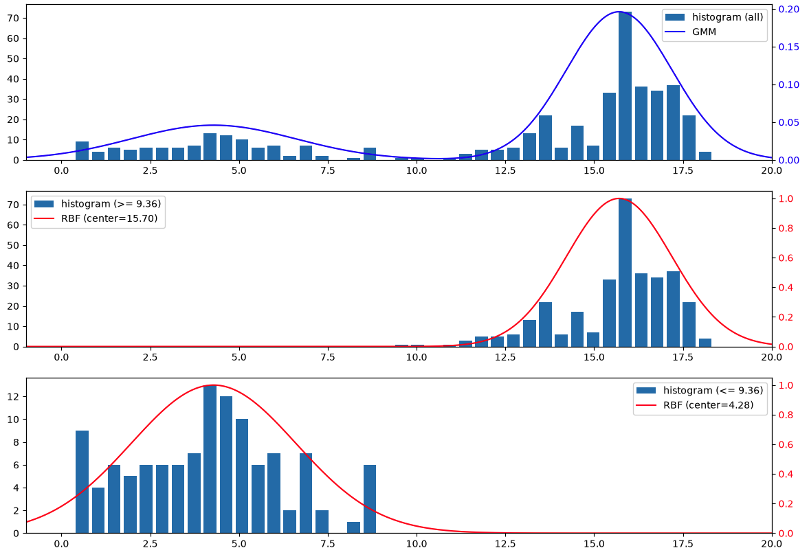
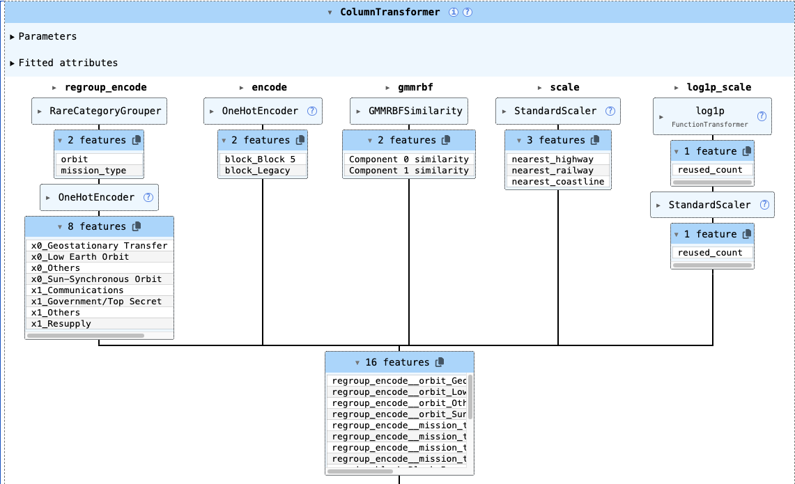

# SpaceY Falcon 9 Project

<a target="_blank" href="https://cookiecutter-data-science.drivendata.org/">
    
</a>

>This project was completed as the capstone for IBM's Data Science Professional Certificate. The business scenario 
(competing launch provider "SpaceY") is a fictional framing provided by the course; all underlying data and analysis 
are based on real, publicly available SpaceX launch information.

## Predicting Falcon 9 First Stage Reuse -- A SpaceY Case Study
This project takes the perspective of a data scientist at SpaceY, a fictional new launch provider looking to compete 
with SpaceX. Since the cost of a launch depends heavily on whether the first stage can be recovered, the core question 
becomes: **can we predict, using only publicly available data, whether a Falcon 9 first stage will be successfully reused?** 
Understanding this is the foundation for estimating a competitive launch price.

## Launch Data
The needed attributes in creating the dataset were obtained from various sources:
- General attributes - [Launch Library 2 API (LL2)](https://thespacedevs.com/llapi)
- Payload Mass - [Jonathan McDowell's General Catalogue of Artificial Space Objects (GCAT)](https://planet4589.org/space/gcat/web/launch/ldir.html)
- US Highways Geodata - [usroads.json by bricedev](https://gist.github.com/bricedev/96d2113bd29f60780223?short_path=650495d)
- US Railways Geodata - [North American Rail Network Lines dataset](https://geodata.bts.gov/datasets/usdot::north-american-rail-network-lines/about)
- Global Coastlines Geodata - [Coastline data from Natural Earth](https://www.naturalearthdata.com/downloads/10m-physical-vectors/)
- Florida Coastlines Geodata - [Florida Shoreline dataset](https://hub.arcgis.com/datasets/myfwc::florida-shoreline-1-to-12000-scale/about)

## Features
 - **Selected features:** `payload_mass`, `reused_count`, `orbit`, `mission_type`, `block`, `nearest_highway`, `nearest_coastline`, `nearest_railway`
 - **Transformations to be applied:**
   - `payload_mass` - due to its bimodal distribution, create two features for the two modes representing the similarity of the data with the two modes.
   - `reused_count` - apply a `log1p` transform
   - `orbit` - Categories with less than 10 instances will be grouped to others
   - `block` - Inactive versions will be grouped to `Legacy`
   - `mission_type` - mission types with less than 10 instances will be grouped to `Others`.

<div align="center">
   <figure>
      
      <figcaption>Figure 1: Histogram of Payload Mass.</figcaption>
   </figure>
</div>
<p> </p>
<br>
<div align="center">
   <figure>
      
      <figcaption>Figure 2: Feature Transformations for Predictive Modeling.</figcaption>
   </figure>
</div>

## Performance Evaluation
Average precision was chosen as the basis of model selection. A custom metric has been defined to tune the threshold
of the selected model during training, and to evaluate the performance of the selected model on the holdout set:

$$\text{Gain Score} = -10\cdot \text{FP} -1\cdot \text{FN}$$

where $\text{FP}$ is the number of false positive errors and $\text{FN}$ is the number of false negatives.

## Predictive Modeling
A Support Vector Classifier has been selected, having an average precision $\text{AP}=99.348%$

|                            |                                                       |
|----------------------------|-------------------------------------------------------|
| Tuned Hyperparameters      | `kernel`: "rbf" <br> `C`: 689.130 <br> `gamma`: 0.004 |
| Best Validation Score      | 99.348% (AP) |
| Tuned Threshold            | 0.85 |
| Final Score - `gain_score` | -44.000 |
| Final Precision Score | 96.7% |
| Final Recall Score | 86.3% |

## Quick Start
### Prerequisites
- Python 3.14
- conda 26.3.2

### Clone
```commandline
git clone https://github.com/svd-jelo/SpaceY-Falcon-9-Project.git
```

### Dependencies
To be able to run the scripts, create a virtual environment and install the dependencies specified in the 
`requirements.txt` file. For convenience, run the following command to create a new virtual environment
```commandline
make create_environment
```
Then, run the following command to install all dependencies
```commandline
make requirements
```
### Dataset
After installing the above dependencies, create the training and test sets by running the following command
```commandline
make dataset
```
The above is a convenience command for `python spacey_falcon_9_project/dataset.py`
### Train model
```commandline
make train_model
```
The above command calls `python spacey_falcon_9_project/modeling/train.py`

### Batch Predictions
To run batch inference on a given dataset and a given model
```commandline
make batch_predict \
MODEL_NAME = "model_name"\
[INPUT_PATH = "input_path"] \
[OUTPUT_PATH = "output_path"] \
[MODEL_DIR = "model_dir"]
```
it calls
```commandline
spacey_falcon_9_project/modeling/predict.py \
--model-name \ 
[--input_path INPUT_PATH] \
[--output_path OUTPUT_PATH] \
[--model_dir MODEL_DIR]
```

Note that a valid input set must be a `.csv` file consisting of Falcon 9 launch records with the following attributes:
- `orbit` - orbit type (e.g., LEO)
- `mission_type` - one of the following:

| Category | Mission Type |
| - | - |
| Commercial | Communications, Dedicated Rideshare, Tourism |
| Science & Defense | Government/Top Secret, Earth Science, Astrophysics, Heliophysics, Lunar Exploration, Robotic Exploration, Navigation, Technology.|
| ISS / Spaceflight | Resupply, Human Exploration, Test Flight. |

- `block` - booster version (e.g., Block 5)
- `payload_mass` - payload mass (in metric tons)
- `reused_count` - number of times the booster was reused prior to current launch
- `nearest_highway` - distance of the launch site to the nearest highway
- `nearest_railway` - distance of the launch site to the nearest railway
- `nearest_coastline` - distance of the launch site to the nearest coastline
- `class` - landing outcome; `1` if successful, `0` otherwise.

#### Example
```python
import pandas as pd
from spacey_falcon_9_project.config import processed_dir
from pathlib import Path

sample = {
    'launch_designator': [None, None, None, None],
    'booster_version': ['Falcon 9', 'Falcon 9', 'Falcon 9', 'Falcon 9'],
    'orbit': ['LEO', 'SSO', 'GTO', 'MEO'],
    'mission_type': ['Communications', 'Communications', 'Resupply', 'Navigation'],
    'launch_site': ['Space Launch Complex 4E', 'Space Launch Complex 4E', 'Space Launch Complex 40', 'Launch Complex 39A'],
    'landing_success': [True, True, None, None],
    'landing_type': ['ASDS', 'ASDS', None, None],
    'flights': [19,12,32,20],
    'reused': [True, True, True, True],
    'landing_pad': ['OCISLY', 'OCISLY', None, None],
    'block': ['Block 5', 'Block 5', 'Block 5', 'Block 5'],
    'serial': ['B1088','B1097','B1069','B1060'],
    'longitude': [-120.611,-120.611,-80.57735736,-80.60428186],
    'latitude': [34.632,34.632,28.56194122,28.60822681],
    'reused_count': [18,11,31,19],
    'payload_mass': [15.525, 13.8, 4.2, 1.6],
    'launch_date': ['2026-06-6','2026-08-19','2026-07-09','2024-04-28'],
    'class': [1,1,0,0],
    'nearest_highway': [30.520335019763284,30.520335019763284,21.16901309169849,22.499529870277996],
    'nearest_railway': [1.2527874023926493,1.2527874023926493,21.16901309169849,19.984844572321073],
    'nearest_coastline': [1.4685310654899448,1.4685310654899448,0.930776727110747,0.5448848946073434]
}

sample_df = pd.DataFrame(sample)
sample_df.to_csv(processed_dir.joinpath('sample_input.csv'), index=False)
```

## Project Organization

```
├── LICENSE            <- Open-source license
├── Makefile           <- Makefile with convenience commands like `make data` or `make train`
├── README.md          <- The top-level README for developers using this project.
├── data
│   ├── interim        <- Intermediate data that has been transformed.
│   ├── processed      <- The final, canonical data sets for modeling.
│   └── raw            <- The original, immutable data dump.
│
├── docs               <- A default mkdocs project; see www.mkdocs.org for details
│
├── models             <- Trained and serialized models, model predictions, or model summaries
│
├── notebooks          <- Jupyter notebooks. Naming convention is a number (for ordering),
│                         the creator's initials, and a short `-` delimited description, e.g.
│                         `1.0-cjra-data-collection`.
│
├── pyproject.toml     <- Project configuration file with package metadata for 
│                         spacey_falcon_9_project and configuration for tools like black
│
├── references         <- Data dictionaries, manuals, and all other explanatory materials.
│
├── reports            <- Generated analysis as HTML, PDF, LaTeX, etc.
│   └── figures        <- Generated graphics and figures to be used in reporting
│
├── requirements.txt   <- The requirements file for reproducing the analysis environment, e.g.
│                         generated with `pip freeze > requirements.txt`
│
└── spacey_falcon_9_project   <- Source code for use in this project.
    │
    ├── __init__.py             <- Makes spacey_falcon_9_project a Python module
    │
    ├── config.py               <- Store useful variables and configuration
    │
    ├── dataset.py              <- Scripts to download or generate data
    │
    ├── features.py             <- Code to create features for modeling
    │
    ├── modeling                
    │   ├── __init__.py 
    │   ├── predict.py          <- Code to run model inference with trained models          
    │   └── train.py            <- Code to train models
    │
    └── utils
        ├── __init__.py
        ├── metrics.py         <- Code for custom metric for model evaluation
        └── modeling.py        <- Code to save or load model artifacts
```

